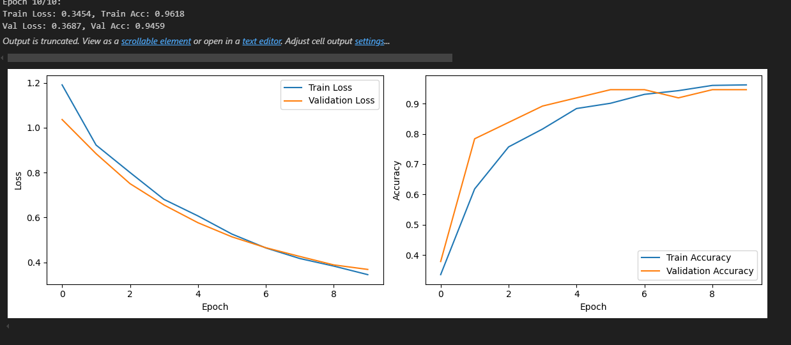
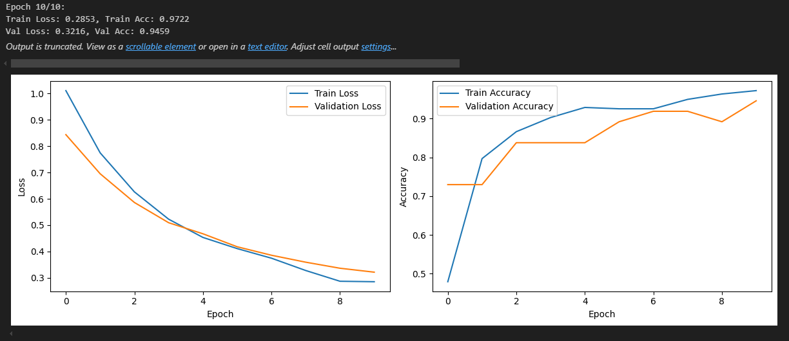

Краткие шаги для воспроизведения примера:

1. Распаковать архив files/auto.zip в корень проекта
2. Создать виртуальную среду python (python -m venv venv)
3. Активировать виртуальную среду (./venv/bin/activate)
4. pip install -r requirements.txt
5. Откройте Jupyter Notebook и просмотрите результаты

---

Результаты примера:

Код с Stratified разделением, с аугментацией и с обучением моделей находится в папке srs

1. Разделили исходный датасет фотографий на обучающий и валидационный
2. Добавили обучающий датасет аугментированными фотографиями (Использовали только те аугментации, которые не выходили за рамки изначального датасета. Отзеркаливание по горизонтали, смещение на малый угол и изменение оттенка/цвета/насыщенности)
3. Обучили на ResNet18 и ResNet50, зафиксировав веса в бэкбоне. 

Получились следующие результаты:
Для обоих моделей примерно одинаковая точность на валидационном датасете: 0.946

